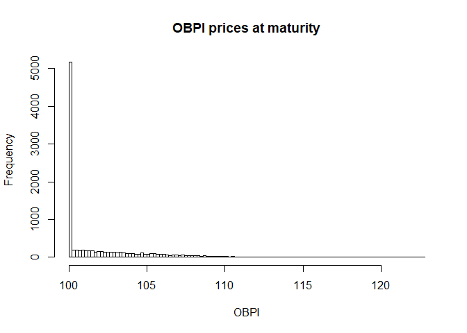
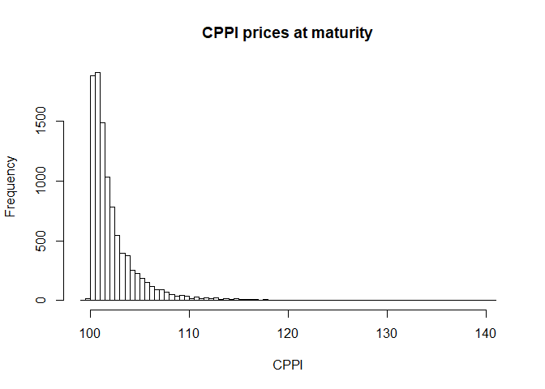

Workshop 3 - Portfolio insurance strategies
================
Pierre Clauss
September 2020

*The following R Markdown document has to be read with my course notes
(in particular for the details of the analysis framework).*

*Not all the R codes are displayed but only some of them to help you to
succeed the workshop.*

## Foreword

There is no data steps in this workshop. I give you the annualised
expected return and volatility of the asset to be insured:

  
  

  
  

``` r
library(tidyverse)
library(scales)
mu <- 0.05
sigma <- 0.20
```

## 1 Analysis framework

I focus on 2 approaches to insure my capital:

1.  Option-Based Portfolio Insurance with a call
2.  Constant-Proportion Portfolio Insurance

*See my course notes for the details of all the formulas.*

## 2 Simulation methodologies

As I want to simplify the workshop using gaussian simulations, I
simulate monthly returns which could be considered more gaussian than
daily or weekly returns. As an alternative not studied here, we could
use more complex modelling with mixtures of gaussian distributions or
Student distributions family.

The maturity of insurance capital is 1 year.

The other assumptions are:   
  
  
  

``` r
delta <- 1 / 12
mat <- 1
rf <- 0.02
strike <- 100
stress <- 0.20
tol <- 0
```

### 2.1 An example with two simulated tracks

``` r
set.seed(1234)

n <- mat / delta
u <- runif(n)

# Moments on simulation path
rf1 <- (1 + rf) ^ delta - 1
mu1 <- (1 + mu) ^ delta - 1
sigma1 <- sigma * sqrt(delta)

# Stock simulation under historical probability and risk-neutral probability (RNP)
r <- qnorm(u, mu1, sigma1)
rRNP <- qnorm(u, rf1, sigma1)

equity <- numeric(n + 1)
equityRNP <- numeric(n + 1)
equity[1] <- strike
equityRNP[1] <- strike

for (i in 1:n)
{
  equity[i + 1] <- equity[i] * (1 + r[i])
  equityRNP[i + 1] <- equityRNP[i] * (1 + rRNP[i])
}

# Call simulation
call <- numeric(n + 1)
call[n + 1] <- max(0, equityRNP[n + 1] - strike)

for (i in 1:n)
{
  d0 <-
    ((rf - sigma ^ 2 / 2) * (mat - (i - 1) * delta) + log(equityRNP[i] / strike)) /
    (sigma * sqrt(mat - (i - 1) * delta))
  d1 <- d0 + sigma * sqrt(mat - (i - 1) * delta)
  call[i] <-
    equityRNP[i] * pnorm(d1) - strike * exp(-rf * (mat - (i - 1) * delta)) *
    pnorm(d0)
}

# Floor simulation
floor <- numeric(n + 1)

for (i in 1:(n + 1))
{
  floor[i] <- strike / (1 + rf) ^ (mat - (i - 1) * delta)
}

# OBPI simulation
obpi_call <- numeric(n + 1)
obpi_call[1] <- strike
gearing <- (obpi_call[1] - floor[1]) / call[1]

for (i in 1:n)
{
  obpi_call[i + 1] <- floor[i + 1] + gearing * call[i + 1]
}

# CPPI simulation
cppi <- numeric(n + 1)
cushion <- numeric(n + 1)
multiplier <- numeric(n + 1)
expo_exante <- numeric(n + 1)
expo_expost <- numeric(n + 1)
cppi[1] <- strike
cushion[1] <- cppi[1] - floor[1]
multiplier[1] <- 1 / stress
expo_exante[1] <- multiplier[1] * cushion[1]
expo_expost[1] <- expo_exante[1]
boundary_inf <- multiplier[1] * (1 - tol)
boundary_sup <- multiplier[1] * (1 + tol)

for (i in 1:n)
{
  expo_exante[i + 1] <- expo_expost[i] * equity[i + 1] / equity[i]
  cppi[i + 1] <-
    expo_exante[i + 1] + (cppi[i] - expo_expost[i]) * floor[i + 1] / floor[i]
  cushion[i + 1] <- cppi[i + 1] - floor[i + 1]
  multiplier[i + 1] <- expo_exante[i + 1] / cushion[i + 1]
  expo_expost[i + 1] <-
    ifelse(
      multiplier[i + 1] < boundary_inf ||
        multiplier[i + 1] > boundary_sup,
      multiplier[1],
      multiplier[i + 1]
    ) * ifelse(cushion[i + 1] < 0, 0, cushion[i + 1])
}

plot(equity, type = 'l', ylab = 'Strategies values', xlab = 'Months', ylim = c(70, 130))
lines(floor, lty = 2)
lines(obpi_call, col = 'blue')
lines(cppi, col = 'green')
leg.txt <- c("Equity", "Floor", "OBPI", "CPPI")
legend(1, 130, leg.txt, col = c("black", "black", "blue", "green"), lty = c(1, 2, 1, 1))
```

<!-- -->

<!-- -->

### 2.2 Monte-Carlo simulations

The number of Monte-Carlo simulations is
.

``` r
nsimul <- 10000
```

    ## # A tibble: 3 x 4
    ##   rowname           Equity   OBPI   CPPI
    ##   <chr>              <dbl>  <dbl>  <dbl>
    ## 1 Annualised return 0.0499 0.0200 0.0233
    ## 2 Volatility        0.195  0.0263 0.0218
    ## 3 Insurance rate    0.559  1      0.998

<!-- --><!-- --><!-- -->

## To conclude the third workshop

This workshop was the last of my course on Asset Management dedicated to
structured portfolios with an objective of capital insurance. I
presented some tools to insure portfolios and study their risks and
performances.
